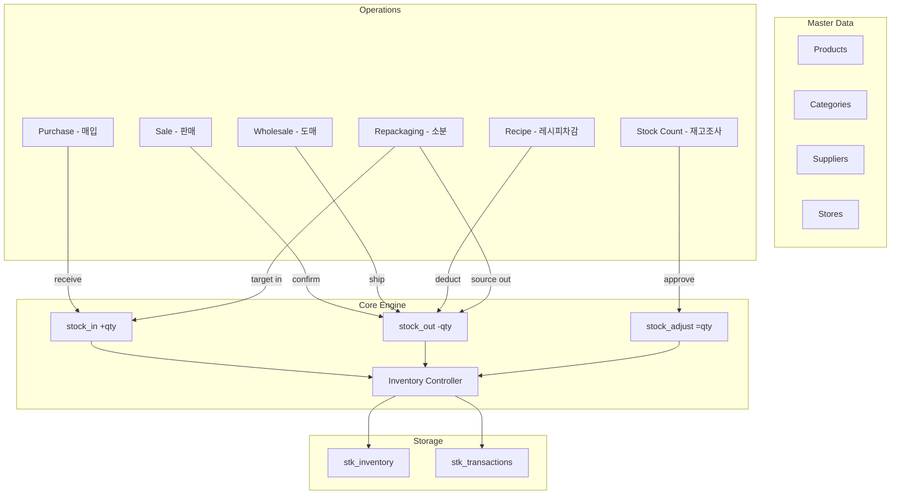
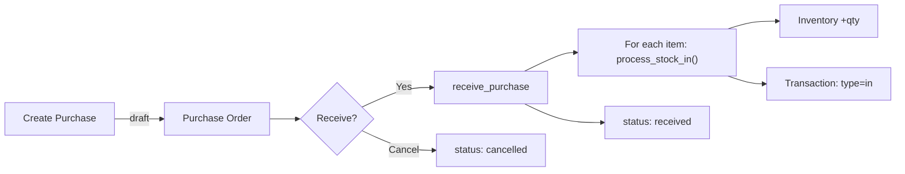
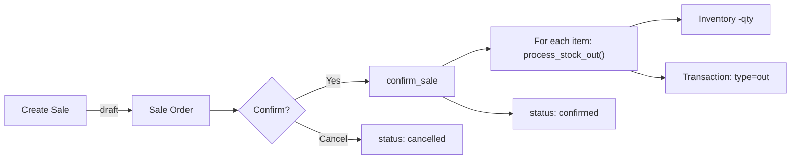
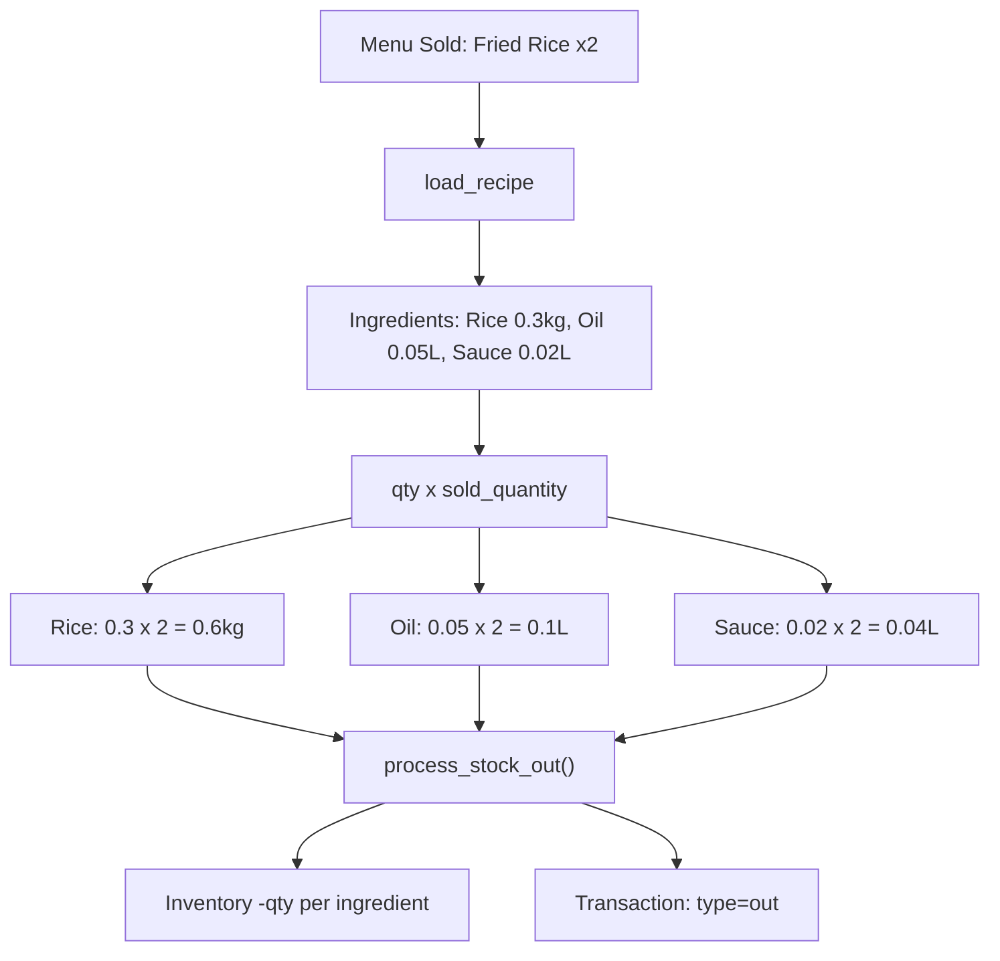
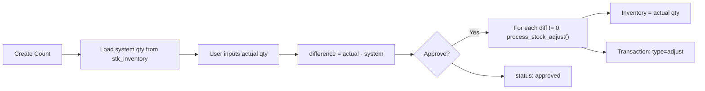
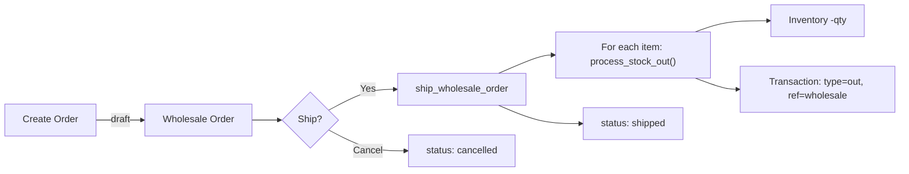
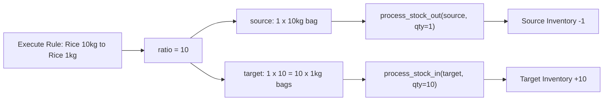
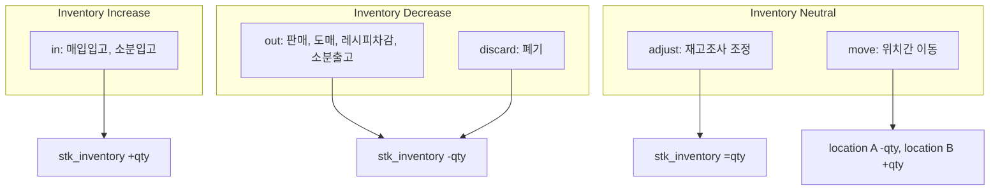
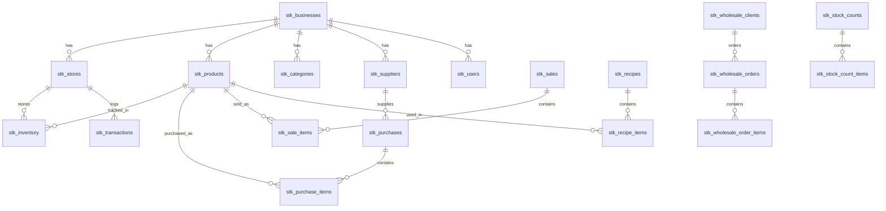

# StockMaster Business Logic Diagram

> 전체 비즈니스 로직 흐름도 - 상품 등록, 매입/입고, 판매/출고, 재고조사, 레시피 차감, 도매, 소분

---

## 1. 전체 시스템 구조 (Overview)

모든 재고 변동은 `inventory_controller.py`를 통해 처리되며, `stk_transactions` 테이블에 기록됩니다.



---

## 2. 매입/입고 흐름 (Purchase Flow)



| 단계 | 함수 | 설명 |
|------|------|------|
| 매입 생성 | `purchase_controller.save_purchase()` | Draft 상태로 매입 주문 생성 |
| 입고 처리 | `purchase_controller.receive_purchase()` | 각 항목을 `process_stock_in()` 호출 |
| 참조 타입 | reference_type: `purchase` | 트랜잭션에서 매입 추적 가능 |

---

## 3. 판매/출고 흐름 (Sale Flow)



| 단계 | 함수 | 설명 |
|------|------|------|
| 판매 생성 | `sales_controller.save_sale()` | Draft 상태로 판매 생성 |
| 판매 확정 | `sales_controller.confirm_sale()` | 각 항목을 `process_stock_out()` 호출하여 재고 차감 |
| 참조 타입 | reference_type: `sale` | 트랜잭션에서 판매 추적 가능 |

---

## 4. 레시피 기반 재고 차감 (Recipe Deduction Flow)

식당에서 메뉴 판매 시 레시피에 등록된 원재료를 자동 차감합니다.



| 단계 | 함수 | 설명 |
|------|------|------|
| 레시피 차감 | `recipe_controller.deduct_by_recipe()` | recipe_id, sold_quantity, store_id |
| 차감 계산 | `ingredient.quantity * sold_quantity` | 각 원재료별 사용량 계산 |
| 원가 계산 | `recipe_controller.calculate_recipe_cost()` | 원재료 단가 기반 레시피 원가 산출 |

### 레시피 원가 계산 예시

```
Fried Rice (1 plate):
  Rice    0.3kg x 2,500원/kg = 750원
  Oil     0.05L x 8,000원/L  = 400원
  Sauce   0.02L x 5,000원/L  = 100원
  ──────────────────────────────────
  Total Cost per plate       = 1,250원
```

---

## 5. 재고조사 흐름 (Stock Count Flow)

실물 재고와 시스템 재고를 비교하여 차이를 조정합니다.



| 단계 | 함수 | 설명 |
|------|------|------|
| 실사 생성 | `stock_count_controller.create_stock_count()` | 시스템 재고 자동 로드 |
| 수량 입력 | `update_stock_count_items()` | 실제 수량 입력, 차이 자동 계산 |
| 실사 승인 | `approve_stock_count()` | 차이가 있는 항목만 `process_stock_adjust()` 호출 |

### 재고조사 예시

| 상품 | 시스템 수량 | 실제 수량 | 차이 | 조치 |
|------|-----------|----------|------|------|
| Rice 10kg | 50 | 48 | -2 | adjust to 48 |
| Soy Sauce 1L | 30 | 30 | 0 | no change |
| Sugar 1kg | 20 | 22 | +2 | adjust to 22 |

---

## 6. 도매 주문 흐름 (Wholesale Flow)

마트 업종에서 도매 거래처에 대량 출고합니다.



| 단계 | 함수 | 설명 |
|------|------|------|
| 주문 생성 | `wholesale_controller.save_wholesale_order()` | 업체별 할인가 자동 적용 |
| 출고 처리 | `ship_wholesale_order()` | 각 항목을 `process_stock_out()` 호출 |
| 할인 체계 | `stk_wholesale_pricing` | 업체별 할인율 또는 고정가 |
| 참조 타입 | reference_type: `wholesale_order` | 트랜잭션에서 도매 추적 가능 |

---

## 7. 소분/리패키징 흐름 (Repackaging Flow)

마트 업종에서 대용량 상품을 소량으로 소분합니다.



| 단계 | 함수 | 설명 |
|------|------|------|
| 규칙 설정 | `save_repackaging_rule()` | 원재료 -> 소분상품, 비율 설정 |
| 소분 실행 | `execute_repackaging()` | 원재료 출고 + 소분상품 입고 동시 처리 |
| 비율 계산 | `target_qty = source_qty x ratio` | 자동 계산 |

### 소분 예시

```
Rule: Rice 10kg -> Rice 1kg (ratio = 10)
Execute: source_qty = 2

Result:
  Rice 10kg: -2 bags (stock out)
  Rice 1kg:  +20 bags (stock in)
```

---

## 8. 재고 변동 유형 요약 (Inventory Transaction Types)



| Type | 설명 | 트리거 |
|------|------|--------|
| **in** | 입고 | 매입 Receive, 소분 입고 |
| **out** | 출고 | 판매 Confirm, 도매 Ship, 레시피 Deduct, 소분 출고 |
| **adjust** | 조정 | 재고조사 Approve |
| **discard** | 폐기 | 수동 폐기 처리 |
| **move** | 이동 | 위치간 재고 이동 (warehouse -> store 등) |

---

## 9. 데이터베이스 관계도 (Database Schema Overview)



---

## 10. 엑셀 Import/Export 지원

| 모듈 | Template | Upload | Export |
|------|----------|--------|--------|
| Products | O | O (Create/Update by Code) | O |
| Purchases | O | O (Group by Date+Supplier) | O |
| Recipes | O | O (Group by Recipe Name) | O |

---

*Generated: 2026-02-11 | StockMaster Inventory Management System*
